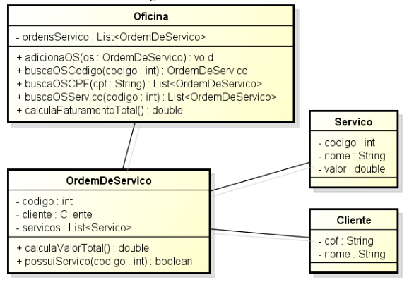

# Trabalho de POO - Oficina
O trabalho era desenvolver o código em Java dado um diagrama de classes. Este diagrama dizia respeito de uma oficina que poderia criar ordens de serviço contendo serviços e clientes vinculados a OS. Era obrigatório elaborar um método para printar as informações das classes (`toString()`). 

## Diagrama UML

## Orientações da atividade

- [x] Todas as classes devem possuir construtor, getters e setters e
  toString.

- **Classe OrdemDeServico**
  - [x] o método calculaValorTotal deve somar o valor de todos
    os serviços e retornar a soma.
  - [x] o método possuiServico deve receber um inteiro referente
    ao código de um Servico e retornar se a OrdemDeServico
    possui o Servico consultado.
- **Classe Oficina**
  - [x] o método buscaOSCodigo deve buscar na lista de ordens
    de serviço a OrdemDeServico que possui determinado
    código ou retornar null.
  - [x] o método buscaOSCPF deve buscar na lista de ordens de
    serviço as OrdemDeServico que possuem determinado
    cliente e retornar uma lista com essas ordens.
  - [x] o método buscaOSServico deve buscar na lista de ordens
    de serviço as OrdemDeServico que possuem determinado
    serviço e retornar uma lista com essas ordens.
  - [x] o método calculaFaturamentoTotal deve somar o valor
    total de todas as ordens de serviço e retornar essa soma.
- **Crie a classe principal a qual deve possuir o seguinte:**
  - [x] Uma Oficina
  - [x] Três objetos do tipo Servico
  - [x] Três objetos do tipo Cliente
  - [x] Seis objetos do tipo OrdemDeServico de preferência com
    mais de um Servico em cada uma.
- **Realize os seguintes testes:**
  - [x] Busque uma OrdemDeServico por código na Oficina e
    imprima o cálculo de seu valor total.
  - [x] Busque uma lista de OrdemDeServico por CPF na Oficina
    e a imprima.
  - [x] Busque uma lista de OrdemDeServico por Servico na
    Oficina e a imprima.
  - [x] Imprima o faturamento total da oficina.

    
